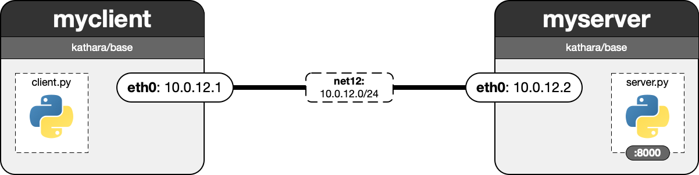

# Lab 01: Baby Steps - Getting to know Kathara

In this first, easy lab, we want you to get familiar with the Kathara network emulator. Start by exploring the provided lab files and launching the environment with Kathara; initially, the devices are isolated. Your first task is to inspect the available network interfaces on each host. Then, you will connect and configure the devices and run a simple HTTP client and web server on them.

This is the desired setup:

 - **Q1:** Before modifying anything, which interfaces do the two hosts have? Which of these can you actually send packets to right now?
  
 - **A1:** Both have the following interfaces: lo, tunl0, gre0, gretap0, erspan0, ip_vti0, ip6_vti0, sit0, ip6tnl0, ip6gre0. Only the lo (loopback) interface is UP and has an IP address (127.0.0.1). Therefore, the hosts can currently only send packets to themselves — no communication with other hosts is possible at this point.
  
 - **T1:** Modify the lab configuration (lab.conf) so both hosts are connected to the same collision domain (network).
  
  
 - **T2:** Adapt each host's startup file so their respective `eth0` interface is assigned the IP addresses specified by the network diagram.
  

 - **Q2:** How do the interface configurations change once the devices are connected?

 - **A2:** After connecting the devices and configuring their `eth0` interfaces, each host now has a second interface in addition to `lo`. Specifically:  `myclient` has `eth0` with IP `10.0.12.1/24` and `myserver` has `eth0` with IP `10.0.12.2/24`. The `eth0` interfaces are in the same subnet and on the same virtual network (`net12`), allowing the hosts to communicate directly. This is confirmed by successful ping between them.

 - **T3:** Implement a basic python-based web server in the provided server.py file. It should listen on IP `0.0.0.0` (i.e., all IP addresses), and it should respond to HTTP requests with a static string of the form "Hello \<word of your choice\>." Make sure to afterwards launch your implementation in the startup file. A skeleton file that handles argument parsing has been provided for you.
 - **T4:** Implement a basic python-based web client in the provided client.py file. The client is called with the IP and port to send the request to as parameters, and it should print the body of the HTTP response (i.e., "Hello \<word of your choice\>."). A skeleton file that handles argument parsing has been provided for you.

**Note:**
Particularly in this first lab, please adhere strictly to the subnets, ports, and IPs as described in the tasks and the diagram. Specifically, ensure that you use collision domain/network name provided in the diagram. The grader will execute `python3 client.py <IP> <PORT>` on `myclient` and will expect the webserver to already be running on `myserver`. In your webserver and client, only use python modules bundled with a standard python installation (so none which you need to explicitly install using pip).
