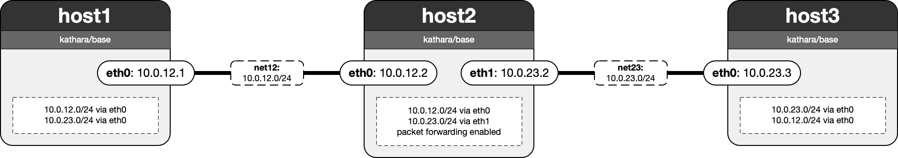

# Lab 02: Line of Routers - Static Linux Routing

In this lab, you will get hands-on experience with basic Linux routing. The lab consists of three routers arranged in a line. After configuring the IP addresses on each router as specified in the network diagram, you'll explore the Linux routing table and learn how to add static routes.

This is how it should look like:

 - **T1:** Assign IP addresses to each host's interface(s) according to the network diagram using their respective startup scripts.
 - **Q1:** What does the routing table look like on each router immediately after this initial IP configuration? Who can reach whom initially?
 - **A1:** \<WRITE YOUR ANSWER HERE\>
 - **Q2:** What does a route actually contain as a "destination"? Is it an end host, a subnet, or something else?
 - **A2:** \<WRITE YOUR ANSWER HERE\>
 - **T2:** Add a static route on host1 to the network containing host3's IP address.
 - **Q3:** Try to `ping` host3's IP address from host 1. Why does it work (or not)?
 - **A3:** \<WRITE YOUR ANSWER HERE\>
 - **T3:** Add anoter static route, this time on host3, to reach host1.
 - **Q4:** Can you `ping` host3 now?
 - **A4:** \<WRITE YOUR ANSWER HERE\>

There is one more step to turn a Linux host into a router, but we already did that for you: enable packet forwarding. By default, packet forwarding is disabled on many Linux hosts, meaning they only accept IP packets with a destination IP associated with the host itself. If packet forwarding is disabled, you can enable it using `sysctl -w net.ipv4.ip_forward=1` (might require elevated permissions).

As you can see, manually configuring even just a handful of routes can be very cumbersome. Thus, while this manual configuration illustrates the necessary steps and serves an educational purpose, it is far too cumbersome and error-prone for use in production networks. In the next labs, you will start working with _routing protocols_ which automate the discovery of routes and the population of the routing tables.

**Bonus:**
If you want the real "internet experience," start a web server on host3 (for example, using the free open source Apache2 bundled with most Linux distributions) and then use `curl` from host1 to fetch the webpage. Congratulations – that's your very own small internet!

**Note:**
Make sure to again follow the network diagram for IP addressing and route configuration. The grader will validate your routing tables to ensure that the routes and forwarding behavior match the expected configuration.
