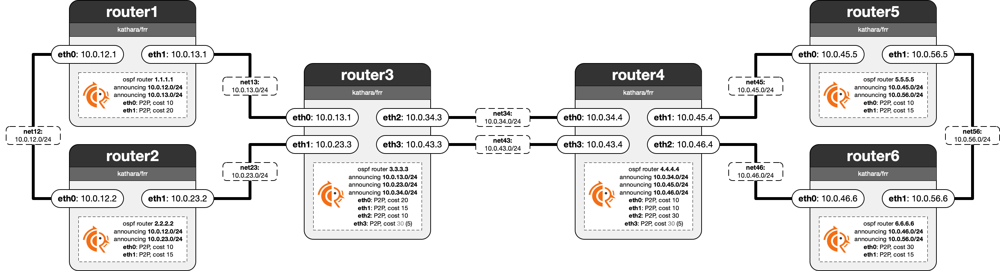

# Lab 03: OSPF in FRR

In this lab, imagine you are the network administrator for router1. Your task is to configure router1 so it participates in the OSPF protocol together with the other routers. The other routers have already been set up by their administrators, you may inspect their configurations using the FRR VTY shell, or by looking at their config files.

 - **Q1:** Which FRR command allows you to display the current OSPF neighbors?
 - **A1:** \<WRITE YOUR ANSWER HERE\>
 - **T1:** Configure the IP addresses on router1’s interfaces according to the diagram using its startup file.
 - **T2:** Start the FRR daemon on router1 using its startup file.
 - **T3** (Main Task): Configure the OSPF daemon on router1 so that it properly exchanges routes with the other routers.
 - **T4:** The administrators of router3 and router4 have decided to upgrade the connection on "net43" by replacing the old, dusty cable with a new, high-speed fiber cable - reducing the link cost from 30 to 5. Implement this change in router3's and router4's FRR configurations.
 - **Q2:** How can you inspect the routes found with OSPF along with their associated costs? Determine the cost of the route from a device in net12 to a device in net45.
 - **A2:** \<WRITE YOUR ANSWER HERE\>
 - **Q3:** If you check the linux routing table, how can you recognize routes that were added by FRR/OSPF?
 - **A3:** \<WRITE YOUR ANSWER HERE\>
