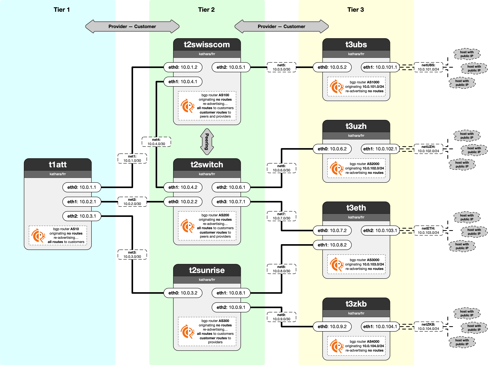

# Lab 04: BGP in FRR

In this lab, you implement the BGP selection and export policies which you learned about in the lecture. This lab gives you a thorough understanding of BGP and teaches you how to program BGP routers using the industry-standard FRR router.



In this lab, you are given the AS topology shown in the network diagram. It comprises 8 ASes, each operating a single BGP router running FRR. The AS configurations lack appropriate selection and export policies, which causes them to advertise routes to neighbors they should not. For example, ASes advertise routess from providers to all other providers, peers, and customers they are connected to.

## Lab Folder Structure
Each AS has a dedicated FRR configuration file `<AS-Name>/etc/frr/frr.conf` which is loaded whenever you start the lab. These configurations set up the basic BGP sessions but lack any selection and export policies.  The file `shared/ruleset.conf` will be appended to the bottom of each router's configuration file.

## Tasks
You are tasked to implement appropriate selection and export policies for each AS according to the above description and what you learned in the lectures. To that end, you have to define FRR route-maps and assign them each AS individually. Defining individual selection and export policies for 8 ASes may seem tedious at first, but by structuring your route-maps well you can greatly reduce your effort.

 - **Q1:** A host in UZH (t3uzh) wants to check its balance using the ZKB e-banking hosted in t3zkb. Which route does the traffic take before implementing any policy? Provide the AS-level path in the form `t3uzh-AS2-AS3-...-t3zkb` without any justification.
 - **A1:** \<WRITE YOUR ANSWER HERE\>
 - **Q2:** Which route does the traffic take if you only implemented the selection policy but no export policy? Provide the AS-level path in the form `t3uzh-AS2-AS3-...-t3zkb` without any justification.
 - **A2:** \<WRITE YOUR ANSWER HERE\>
 - **Q3:** Which route does the traffic take after you implement both selection and export policy? Provide the AS-level path in the form `t3uzh-AS2-AS3-...-t3zkb` without any justification.
 - **A3:** \<WRITE YOUR ANSWER HERE\>
 - **Q4:** Why do we not need to specify the source IP for pinging an ASto which we are directly connected? For example, `t2swisscom` *can* ping `10.0.101.1` without specifying a source IP. Provide a brief answer in at most 2 sentences.
 - **A4:** \<WRITE YOUR ANSWER HERE\> 
 - **T1:** Implement all BGP routing policies as route-maps in the shared ruleset.conf file. 
 - **T2:** For each AS, apply the appropriate route-maps (in- and outbound) to each of their neighbors by modifying their respective FRR config files.
 - **T3:** To ensure Tier-3 ASes announce their local IP prefixes to their providers, assign them the same local preference value as routes received from customers. Implement this by applying the customer route-map for inbound routes to the IP prefixes directly.


**Important Note About Pinging:**
Using the `ping <DST-IP>` command to test connectivity requires special consideration in this lab. If you want to ping an AS from an AS not directly connected to it (e.g., if you wanted to ping `t1att` from `t3ubs`), you have to explicitly specify a source IP which has been announced via BGP. This is because any `ping` packet (ICMP echo request) will otherwise be sent out with the source IP set to the interface's IP from which it is sent (e.g., `10.0.5.2` for `t3ubs`). Further, any ping response (ICMP echo response) is sent back to that source IP. We do not announce these interface IPs through BGP (verify this in the FRR configurations) however, so only ASes directly connected have a routing table entry for these IPs.

Overwriting the default source IP (e.g., `10.0.5.2` for `t3ubs`) to one that is announced through BGP enables the ping response to be routed correctly. For example, if you wanted to ping `10.0.102.1` from `t3ubs`, you specify `10.0.101.1` as source IP. The command for doing so is:

```bash
ping <DST-IP> -I <SRC-IP>
```
