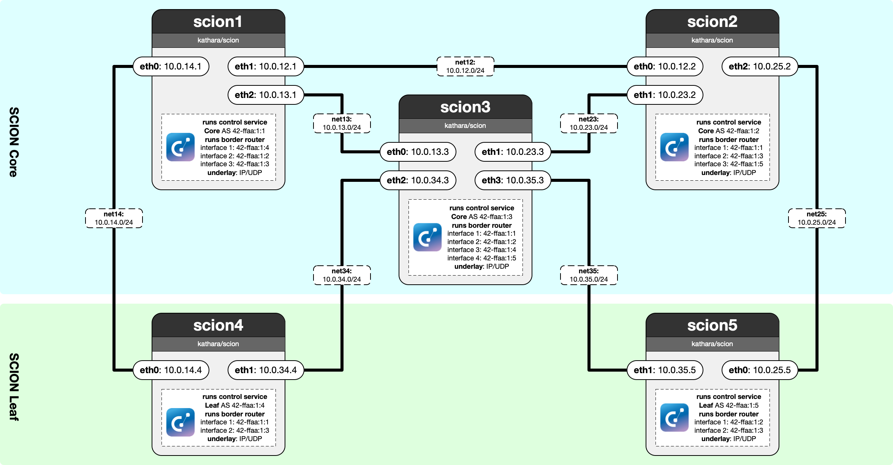

# Lab 05: SCION

In this lab, you are the proud network operator of an AS, and you are tasked with configuring their first SCION router scion1. Luckily, your colleagues from other ASes were kind enough to share their configuration with you. You are tasked with configuring scion1 according to the diagram below. While typically SCION configurations are generated automatically from the so-called topology generator, in this lab you are provided with an almost complete topology already where all the config files and cryptographic material has been pre-generated for you. Your task is to finish the topology.json file by filling in the missing link information.

In this lab, as with the previous BGP lab, the entire AS (including all SCION services) is running inside a single Docker container. This is a simplification to a real deployment, where SCION services would run on many different machines spread across physical infrastructure of the AS.

 - **T1:** Firstly, launch all the SCION services on scion1 as described in the startup file. Some services might still crash, due to the invald topology.json.
 - **T2:** Edit the topology.json file to complete the Border Router section. Fill in all the missing link information according to the diagram provided.
 - **Q1:** Explore the available SCION commands. For example, if you are on scion1, try to perform `scion showpaths` to scion3 - what paths are available to you?
 - **A1:** \<WRITE YOUR ANSWER HERE\>
 - **Q2:** Is scion4 included in any of these paths? Explain why or why not.
 - **A2:** \<WRITE YOUR ANSWER HERE\>
 - **Q3:** Next, attempt to `scion ping` scion5 from scion1. What is the main difference with this command, compared to `scion showpaths`?
 - **A3:** \<WRITE YOUR ANSWER HERE\>
 - **Q4:** Why can't you use the normal Linux ping command to reach scion5 from scion1? It might help to look at the standard Linux routing table.
 - **A4:** \<WRITE YOUR ANSWER HERE\>

**Hint**
While this is not required and may be freely configured within the SCION topology, we ensure consistency between the hardware and SCION interface numbers. Meaning `eth0` is interface 1, `eth1` is interface 2 etc.
Also, you can use port 5000 for all border router underlay connections.

**Note:**
If the Border Router or any other SCION service still crashes after you have properly configured the topology.json file, inspect the log files under `/var/log/journal` to determine the cause of the issue.
