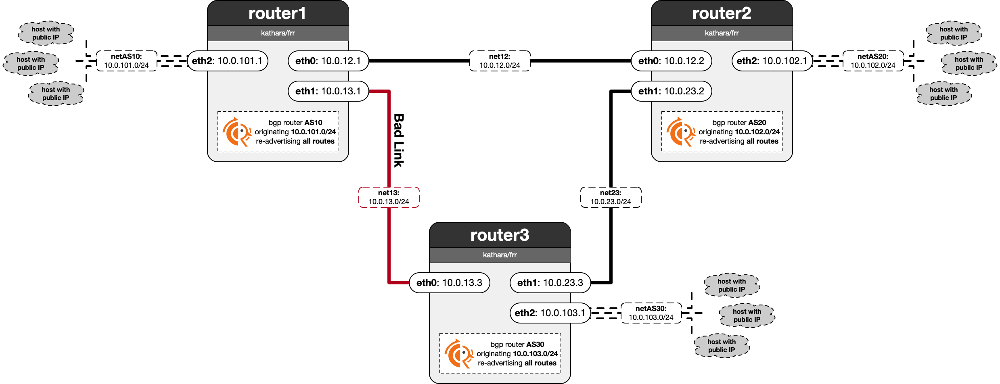

# Lab 06-1: The Triangle Problem in BGP

In this lab, you are in control of a single BGP AS, and you have configure it such that neither inbound (from other ASes to your AS) nor outbound traffic (from your AS to other ASes) uses a specific bad link. You are only allowed to modify the configuration of your AS' router (router1), so you cannot simply change other configurations to achieve your goal. Instead, creative use of BGP attributes is required to get other ASes to not send traffic via the bad link.
Later in lab 6-2, you will see how future internet architectures like SCION deal with the same problem much more elegantly.

## Traffic Engineering in BGP

Traffic Engineering (TE) is a technique that allows network operators to control how traffic flows through their networks. In inter-domain routing, we distinguish between two types of traffic engineering:

- **Egress Traffic Engineering:** Controls how traffic exits your AS towards other ASes.
    - Determines which links your AS uses to send traffic to external prefixes.
    - Easy to implement as you have direct control over your AS' routing decisions.

- **Ingress Traffic Engineering:** Controls how traffic enters your AS from other ASes.
    - Determines which links other ASes use to send traffic to your prefixes.
    - More challenging to implement as it requires influencing other ASes' routing decisions.

In this lab's context:
- Ingress TE ensures that router2 and router3 avoid the bad link when sending traffic to your AS' prefix `10.0.101.0/24`.
- Egress TE ensures your AS (respectively `router1`) avoids the bad link when sending traffic to `10.0.102.0/24` and `10.0.103.0/24`.

### Challenges of Ingress Traffic Engineering

While egress TE is straightforward because you control your own AS' routing decisions, ingress TE is more complex. The main challenges are that you cannot directly control how other ASes route their traffic, and that BGP only offers very limited ingress TE mechanisms. While BGP provides the Multi-Exit Discriminator (MED) attribute to signal route preferences to neighbors, it is ignored by many ASes and it is mainly useful between directly connected ASes with multiple links (e.g. ASes connected with each other in Zurich and in Lausanne).

Simple approaches like not announcing routes through certain links are generally discouraged because they may cause connectivity issues for ASes that do not have alternative routes and could violate agreements between ASes (e.g., provider-customer contracts). Instead, network operators typically (ab)use BGP attributes in creative ways to achieve their ingress TE goals while maintaining connectivity.

## The Lab

In this lab, you are presented with a network topology consisting of three ASes, as shown in the diagram below. As a network operator of AS10, you can only modify the configuration of AS10's router (`router1`). To simplify the exercise, we have removed all business relationships between ASes, so you don't need to consider them.

The network has a problem: the direct link between AS10 (router1) and AS30 (router3) is suffering from poor performance. Your task is to implement traffic engineering solutions that avoid using this degraded link by:

- **Implementing ingress traffic engineering (ingress TE):** Ensure that traffic from AS20 and AS30 to your prefix `10.0.101.0/24` does not use the bad link.

- **Implementing egress traffic engineering (egress TE):** Ensure that traffic from your AS to the prefixes `10.0.102.0/24` and `10.0.103.0/24` does not use the bad link.

**Notes:**
- Remember that you can only modify AS10's configuration - you must find creative ways to influence other ASes' routing decisions through BGP attributes.
- You are not allowed to outright block any routes (e.g., by not announcing `10.0.101.0/24` via the bad link).
- **Windows Users:** This lab will not work correctly if you are using the Docker WSL backend - please ensure you are using the Hyper-V backend.
- **Hint:** Reading the following section of the BGP documentation may be helpful since it explains the precedence of BGP attributes during BGP route selection: https://docs.frrouting.org/en/latest/bgp.html#route-selection.

### Lab Folder Structure
Each AS has a dedicated FRR configuration file which is loaded whenever you start the lab. Since you are only in control of AS10, you are permitted to modify the file `as10/etc/frr/frr.conf`. Changes to any other file cause you to automatically fail the lab.

### Tasks
You have to perform traffic engineering such that neither traffic from AS10 to AS30 (egress TE), nor traffic from AS30 to AS10 (ingress TE) uses the bad link. As described above, heavy-handed approaches for ingress TE, such as not announcing certain routes, are not permitted. Instead, you have to influcent AS30's BGP decision process using BGP attributes such that it prefers using the route via AS20. You can find a list of BGP path attributes in [RFC4271](https://www.rfc-editor.org/rfc/rfc4271.html).

 - **T1:** Implement *egress TE* using FRR route-maps.
 - **Q1:** What BGP path attribute did you use for *egress TE*?
 - **A1:** The provided ffr doc specified that weight check has the highest precendence thus I changed the weights such that the neighbour 10.0.12.2 has higher weight than (bad link) neighbour 10.0.13.3
 - **T2:** Implement *ingress TE* using FRR route-maps.
 - **Q2:** What BGP path attribute did you use for *ingress TE*?
 - **A2:** \<WRITE YOUR ANSWER HERE\>
 - **Q3:** It can take some time for an AS to realize a link is show and change its routing accordingly. Is there a way for hosts to influence this routing decision or even route around any bad link proactively?
 - **A3:** \<WRITE YOUR ANSWER HERE\>
