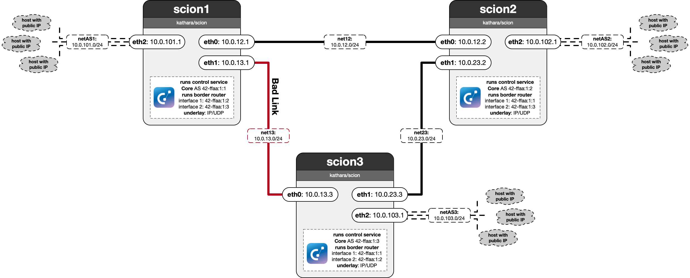

# Lab 06-2: The Triangle Problem in SCION

As you had experienced in the previous lab, performing even simple traffic engineering operations in BGP can require intricate and fragile BGP attribute tuning. In this lab, you will now see how SCION elegantly supports traffic engineering natively.

You will work on the same triangle topology, but with SCION ASes replacing BGP ASes. For your convenience, the lab is already correctly configured, so no further configuration changes are necessary. Instead, you take the view of a host in the AS scion1, and you have to identify the bad link and route around it, all while using tools provided by SCION.

## Tasks

 - **Q1:** How were you able to identify the bad link with high latency? Include the exact SCION commands (including any command line flags) you used.
 - **A1:** by using the interactive traceroute mode in the host on scion1 ->  "scion traceroute -i 42-ffaa:1:3,127.0.0.1" then I could select both existing routes and got the times for each hop thhey took, where I could spot that the hop via the bad link took roughly 100ms.
 - **Q2:** SCION provides fine-grained path control to end hosts, whereas in the BGP internet hosts have no control over which paths traffic is routed. Compare both approaches by providing a list of trade-offs for each approach.
 - **A2:** 

| Aspect | **SCION – host selects path** | **BGP – network selects path** |
|--------|------------------------------|--------------------------------|
| **Path control** | Host chooses & verifies full AS sequence. | Host has no choice; path is opaque. |
| **Fail-over speed** | RTT-level; host can switch instantly. | Seconds – minutes (BGP convergence). |
| **Security** | Cryptographic hop fields → hijack-resistant. | Prone to leaks/hijacks; RPKI optional. |
| **Traffic engineering** | Fine-grained (latency, trust, policy). | Indirect knobs (MED, prepending). |
| **Host complexity** | Requires path discovery & ranking logic. | Classic IP stack; zero extra logic. |
| **Header overhead** | Larger: path carried in every packet. | Minimal: next-hop only. |
| **Operator control** | May bypass provider business policies. | Centralised in AS routers; preserves contracts. |
