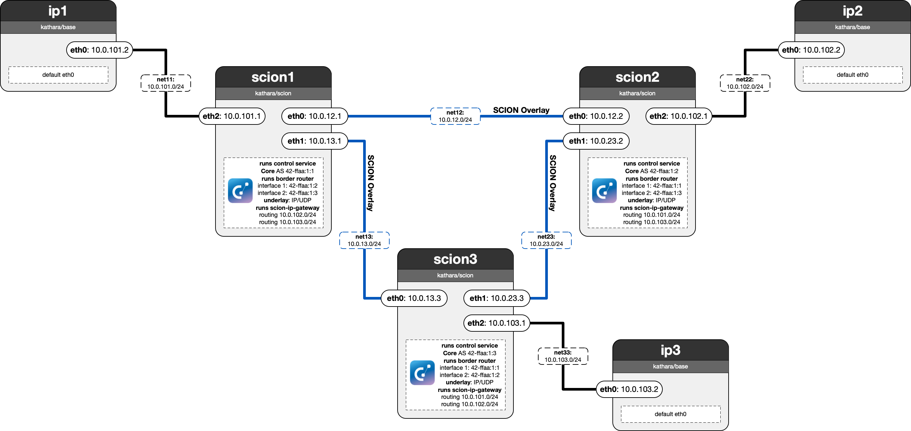

# Lab 07: SCION IP Gateway

In the last lab, you learn how to integrate SCION with the existing IP infrastructure by setting up a SCION IP gateway (SIG). In this lab, IP-only devices `ip1`, `ip2`, and `ip3` are connected to SCION ASes `scion1`, `scion2`, and `scion3` respectively. The goal is to enable communication among IP-only services using SCION/SIG.

For this lab, you are once again - who would have guessed - the network administrator of `scion1`. Your task is to enable the SIG on startup, and configure it using the `gateway.json` file. The other two ASes have already completed these steps.

 - **T1:** Edit the gateway.json file to complete the configuration so that the SCION IP gateway properly forwards packets to the other ASes.
 - **T2:** Start the SCION IP Gateway service.
 - **Q1:** Inspect the Linux IP routing table before and after starting the gateway. What has changed in the routing entries?
 - **A1:** additionally there are the following two entries: "10.0.102.0/24 dev sig metric 15, 
10.0.103.0/24 dev sig metric 15"
 - **Q2:** Based on your observations, can you compare the SCION IP gateway with another technology that you already know?
 - **A2:** the gateway is conceptually the overlay tunnel terminator for SCION—functionally akin to technologies such as GRE, IPsec site-to-site gateways, or MPLS PE devices that are used for example in VPN services.
 - **T3:** From IP1, ping the other IP-only hosts and verify that the packet forwarding through the gateway is working correctly.
